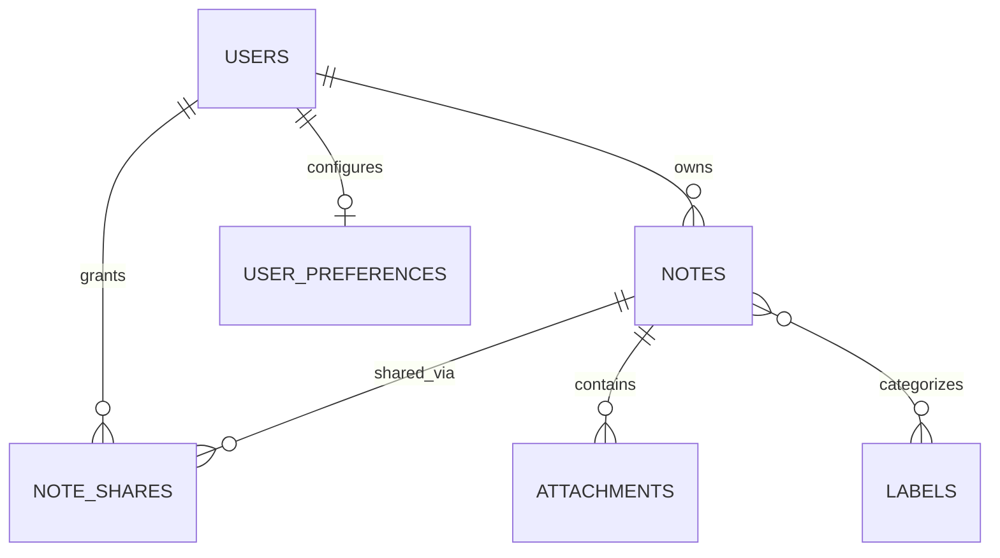

# Database Architecture and Schema Specification

This document defines the authoritative database runtime standards, environment isolation boundaries, physical migration baseline, and planned domain entity relationships for the Collaborative Intelligent Note Management Web Application.

> **Status Notice:** This document records the **Foundation Baseline** established in **Phase 1 Step 4**. At this stage, only Laravel's migration repository infrastructure (`migrations` table) exists physically in the database. Domain entities documented below are planned specifications and are not yet implemented.

---

## 1. Database Runtime Standards

All persistence environments must strictly adhere to the following database standards:

- **RDBMS Engine:** MySQL 8.x (Host verified: MySQL Community Server `8.4.3`)
- **Default Storage Engine:** `InnoDB` (ACID compliance, row-level locking, foreign key enforcement)
- **Character Set:** `utf8mb4` (Full 4-byte UTF-8 support including emojis and multilingual text)
- **Collation:** `utf8mb4_unicode_ci` (Unicode Collation Algorithm standard)
- **Timezone:** `UTC` (All timestamps stored in UTC)

---

## 2. Environment Isolation

The application enforces strict database separation between runtime environments:

| Environment | Database Name | Purpose | Access Policy |
| :--- | :--- | :--- | :--- |
| **Development** | `final_web` | Local developer runtime | Bound via `.env`; migrations executed deliberately per phase |
| **Testing** | `final_web_test` | Automated test suite & CI | Bound via `.env.testing`; protected by test safety guards |
| **Production** | Defined at deploy | Future production environment | Isolated credentials; managed container / hosted RDS |

### Test Database Safety Guard
To eliminate the risk of automated test runs mutating or truncating developer data, all database-backed tests inherit from `Tests\TestCase` which enforces `assertDatabaseSafety()`:
- Tests strictly refuse execution if the active database is `final_web` or does not end with `_test`.

---

## 3. Current Physical Schema Baseline (Phase 1 Step 4)

In accordance with Phase 1 boundary rules, generic Laravel scaffold migrations (`users`, `cache`, `jobs`) were audited and removed before initialization. The physical database contains only the framework migration repository table:

### Table: `migrations`
Established via `php artisan migrate:install`.

| Column | Type | Attributes | Description |
| :--- | :--- | :--- | :--- |
| `id` | `INT UNSIGNED` | Primary Key, Auto Increment | Unique migration ID |
| `migration` | `VARCHAR(255)` | Not Null | Migration file name identifier |
| `batch` | `INT` | Not Null | Execution batch grouping number |

**Current Table Inventory:**
- `final_web`: `migrations` (1 table)
- `final_web_test`: `migrations` (1 table)
- **Domain Tables Present:** None

---

## 4. Planned Conceptual Domain Entities

The application domain schema will be introduced in strict phase sequence. Column definitions are architectural specifications and will be formally migrated during their respective phases.

### Entity Overview

1. **`users` (Phase 2: Authentication & Account Management)**
   - **Role:** Central identity record for registered users.
   - **Key Attributes:** `id`, `email` (unique), `display_name`, `password_hash` (`bcrypt` only), timestamps.
   - **Rule:** Aligned strictly with rubric requirements (`email`, `display name`, `password`, `password confirmation`).

2. **`user_preferences` (Phase 2 / Phase 9: UX Preferences)**
   - **Role:** Stores user-specific settings (e.g., UI theme, editor preferences).
   - **Relationship:** 1-to-1 with `users`.

3. **`notes` (Phase 3: Core Notes Management)**
   - **Role:** Primary note content and metadata.
   - **Key Attributes:** `id`, `user_id` (foreign key -> `users.id`), `title`, `content` (Markdown/rich text), `is_pinned` (boolean), `is_archived` (boolean), `password_hash` (nullable, for password-protected notes), timestamps.
   - **Relationship:** Many-to-1 with `users`.

4. **`labels` (Phase 4: Organization)**
   - **Role:** User-defined categorization tags.
   - **Key Attributes:** `id`, `user_id` (foreign key -> `users.id`), `name`, `color`, timestamps.
   - **Constraint:** Unique `(user_id, name)` pairing.

5. **`note_label` (Phase 4: Organization Pivot)**
   - **Role:** Many-to-many junction between notes and labels.
   - **Composite Key:** `(note_id, label_id)` with cascading foreign keys.

6. **`attachments` (Phase 4: Attachments)**
   - **Role:** File attachments linked to individual notes.
   - **Key Attributes:** `id`, `note_id` (foreign key -> `notes.id`), `file_path`, `file_name`, `mime_type`, `file_size`, timestamps.

7. **`note_shares` (Phase 5: Collaborative Sharing)**
   - **Role:** Note access delegations to collaborators.
   - **Key Attributes:** `id`, `note_id`, `shared_by_user_id`, `shared_with_user_id`, `permission` (`read` | `edit`), timestamps.
   - **Security:** Governed by server-side authorization policies (Form Requests / Gates).

8. **AI Persistence (Phase 7: AI Integration — Deferred)**
   - Storing AI conversational grounding or vector embeddings will be designed in Phase 7 only if required.

---

## 5. Phase Schema Delivery Roadmap

| Phase | Milestone | Scope / Tables Introduced |
| :--- | :--- | :--- |
| **Phase 1 (Step 4)** | **Foundation** | `migrations` repository table only. |
| **Phase 2** | **Auth & Accounts** | `users`, password reset tokens, personal access tokens (Sanctum). |
| **Phase 3** | **Core Notes** | `notes`. |
| **Phase 4** | **Labels & Files** | `labels`, `note_label`, `attachments`. |
| **Phase 5** | **Sharing & Protection** | `note_shares`, note password verification columns. |
| **Phase 6** | **Realtime Collab** | Broadcast events (no permanent tables required). |
| **Phase 7** | **AI Features** | AI summary cache / audit tables (if necessary). |
| **Phase 8** | **Offline & PWA** | Client-side IndexedDB mirror schema. |
