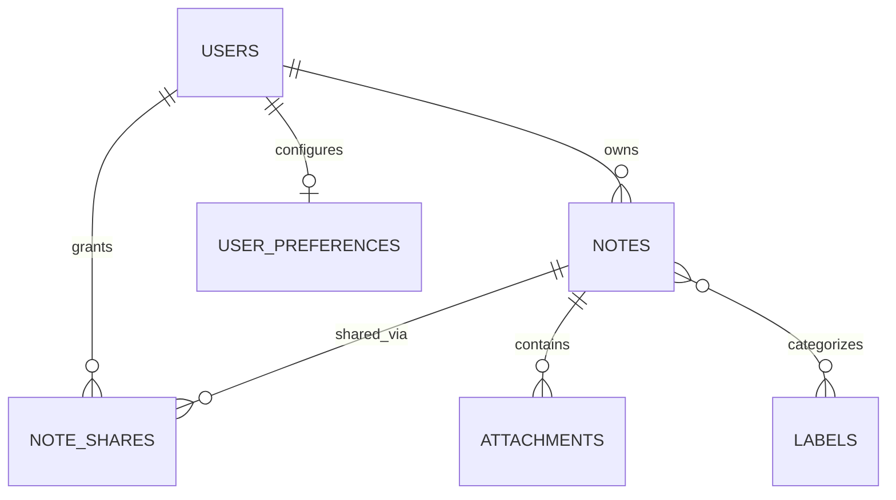

# Database Architecture and Schema Specification

This document defines the authoritative database runtime standards, environment isolation boundaries, physical migration baseline, and planned conceptual entity relationships for the Collaborative Intelligent Note Management Web Application.

> **Status Notice:** This document records the **Phase 4 Organization, Discovery & Media Baseline** (in progress). The physical persistence foundation includes the framework migration repository, Phase 2 authentication and user account tables (`users`, `password_reset_tokens`, `user_preferences`), Phase 3 Core Notes persistence table (`notes`), and Phase 4 organizational extensions. Subsequent domain entities documented below represent conceptual architectural intent and will be frozen in their respective phases.

---

## 1. Database Runtime Standards

All persistence environments must strictly adhere to the following database standards:

- **RDBMS Engine:** MySQL 8.x (Host verified: MySQL Community Server `8.4.3`)
- **Default Storage Engine:** `InnoDB` (ACID compliance, row-level locking, foreign key enforcement)
- **Character Set:** `utf8mb4` (Full 4-byte UTF-8 support including emojis and multilingual text)
- **Collation:** `utf8mb4_unicode_ci` (Unicode Collation Algorithm standard)
- **Timezone:** `UTC` (All timestamps stored in UTC)

---

## 2. Environment Isolation

The application enforces strict database separation between runtime environments:

| Environment | Database Name | Purpose | Access Policy |
| :--- | :--- | :--- | :--- |
| **Development** | `final_web` | Local developer runtime | Bound via `.env`; migrations executed deliberately per phase |
| **Testing** | `final_web_test` | Automated test suite & CI | Bound via `.env.testing`; protected by automatic test safety guards |
| **Production** | Defined at deploy | Future production environment | Isolated credentials; managed container / hosted RDS |

### Test Database Safety Guard
To prevent accidental test mutation under the governed test hierarchy:
- All database-backed tests **MUST** extend `Tests\DatabaseTestCase`.
- `Tests\DatabaseTestCase` automatically verifies during `setUpTraits()` before database-mutating testing traits operate that:
  1. `APP_ENV` is strictly `testing`.
  2. The active database connection is `mysql`.
  3. The active database name equals exactly `final_web_test`.
- If any condition is violated, a `RuntimeException` is immediately thrown before any database-mutating trait (such as `RefreshDatabase`) or test query can execute.
- Generic non-database tests (such as `HealthEndpointTest`) extend `Tests\TestCase` and remain completely database-independent.

---

## 3. Current Physical Schema Baseline (Phase 3 Core Notes)

The physical database schema contains the framework migration repository and the domain tables established through Phase 2 and Phase 3:

### Table: `migrations`
Established via `php artisan migrate:install`.

| Column | Type | Attributes | Description |
| :--- | :--- | :--- | :--- |
| `id` | `INT UNSIGNED` | Primary Key, Auto Increment | Unique migration ID |
| `migration` | `VARCHAR(255)` | Not Null | Migration file name identifier |
| `batch` | `INT` | Not Null | Execution batch grouping number |

### Table: `users`
Established via Phase 2 (`2026_09_03_000001_create_users_table.php`, `2026_09_03_000003_add_avatar_path_to_users_table.php`).

| Column | Type | Attributes | Description |
| :--- | :--- | :--- | :--- |
| `id` | `BIGINT UNSIGNED` | Primary Key, Auto Increment | Unique user identifier |
| `display_name` | `VARCHAR(255)` | Not Null | User profile display name |
| `email` | `VARCHAR(255)` | Unique, Not Null | User login & verification email |
| `email_verified_at` | `TIMESTAMP` | Nullable | Email verification timestamp |
| `password` | `VARCHAR(255)` | Not Null | Bcrypt-hashed password |
| `avatar_path` | `VARCHAR(255)` | Nullable | Internal avatar storage path |
| `remember_token` | `VARCHAR(100)` | Nullable | Sanctum / session remember token |
| `created_at` | `TIMESTAMP` | Nullable | Record creation timestamp |
| `updated_at` | `TIMESTAMP` | Nullable | Record update timestamp |

### Table: `password_reset_tokens`
Established via Phase 2 (`2026_09_03_000002_create_password_reset_tokens_table.php`).

| Column | Type | Attributes | Description |
| :--- | :--- | :--- | :--- |
| `email` | `VARCHAR(255)` | Primary Key | Reset recipient email address |
| `token` | `VARCHAR(255)` | Not Null | Hashed password reset token |
| `created_at` | `TIMESTAMP` | Nullable | Token creation timestamp |

### Table: `user_preferences`
Established via Phase 2 (`2026_09_03_000004_create_user_preferences_table.php`).

| Column | Type | Attributes | Description |
| :--- | :--- | :--- | :--- |
| `id` | `BIGINT UNSIGNED` | Primary Key, Auto Increment | Unique preference record ID |
| `user_id` | `BIGINT UNSIGNED` | Unique, Foreign Key (`users.id` ON DELETE CASCADE) | Owner user identifier |
| `theme` | `VARCHAR(20)` | Default `'system'` | UI color scheme (`system`, `light`, `dark`) |
| `default_note_view` | `VARCHAR(20)` | Default `'grid'` | Default layout mode (`grid`, `list`) |
| `created_at` | `TIMESTAMP` | Nullable | Record creation timestamp |
| `updated_at` | `TIMESTAMP` | Nullable | Record update timestamp |

### Table: `notes`
Established via Phase 3 (`2026_09_04_000001_create_notes_table.php`), extended via Phase 4 M1 (`2026_09_04_000002_add_is_pinned_to_notes_table.php`).

| Column | Type | Attributes | Description |
| :--- | :--- | :--- | :--- |
| `id` | `BIGINT UNSIGNED` | Primary Key, Auto Increment | Unique note identifier |
| `user_id` | `BIGINT UNSIGNED` | Foreign Key (`users.id` ON DELETE CASCADE) | Owner user identifier |
| `title` | `VARCHAR(255)` | Not Null | Note title (1-255 characters) |
| `content` | `TEXT` | Not Null | Note plain-text content body |
| `is_pinned` | `BOOLEAN` | Not Null, Default `FALSE` | Pin status for prioritizing note display |
| `created_at` | `TIMESTAMP` | Nullable | Record creation timestamp |
| `updated_at` | `TIMESTAMP` | Nullable | Record update timestamp |

**Indexes on `notes`:**
- Primary Key: `(`id`)`
- Composite Index: `(`user_id`, `updated_at`)` (Optimizes personal note list queries ordered by recent activity)
- Composite Index: `(`user_id`, `is_pinned`, `updated_at`)` (Phase 4 M1: Optimizes personal note queries ordered by pinned status and recent activity)
- Foreign Key: `(`user_id`)` referencing `users(`id`)` ON DELETE CASCADE

**Current Physical Table Inventory:**
- `final_web` / `final_web_test`: `migrations`, `users`, `password_reset_tokens`, `user_preferences`, `notes` (5 tables)
- **Domain Tables Present:** `users`, `password_reset_tokens`, `user_preferences`, `notes`

---

## 4. Planned Conceptual Domain Entities

The application domain schema will be introduced in strict phase sequence. The following definitions specify conceptual relationships and rubric constraints without prematurely freezing physical column names or types.

### Conceptual Entity Overview

1. **`users` (Phase 2: Authentication & Account Management)**
   - **Entity Purpose:** Central identity record for registered application users.
   - **Relationship Intent:** 1-to-many with notes; 1-to-1 with user preferences; 1-to-many with sharing records.
   - **Phase Ownership:** Phase 2.
   - **Rubric & Frozen Constraints:** Unique email address, display name, bcrypt password representation (`ACC-03`), email verification state (`ACC-04`). Registration password confirmation is strictly request-level validation and is not modeled as a database column. Concrete column naming (`password` vs `password_hash`) and authentication state belong to Phase 2; authentication architecture uses Sanctum first-party cookie/session (personal access tokens are not required).

2. **`user_preferences` (Phase 2 / Phase 9: UX Preferences)**
   - **Entity Purpose:** Stores user-configurable UI settings (e.g., theme preference).
   - **Relationship Intent:** 1-to-1 with `users`.
   - **Phase Ownership:** Phase 2 / Phase 9.

3. **`notes` (Phase 3: Core Notes Management)**
   - **Entity Purpose:** Primary note content and metadata.
   - **Relationship Intent:** Many-to-1 with `users`.
   - **Phase Ownership:** Phase 3 (Core CRUD), Phase 4 (Pinning), Phase 5 (Protection).
   - **Rubric & Frozen Constraints:** Requires storage for owner relationship, title, content, pin state (`NOTE-06`, Phase 4), password protection representation (`SHARE-01`, Phase 5), and timestamps. Speculative fields (e.g., archive state) are excluded.

4. **`labels` (Phase 4: Organization)**
   - **Entity Purpose:** User-defined organization tags.
   - **Relationship Intent:** Many-to-1 with `users`; many-to-many with `notes`.
   - **Phase Ownership:** Phase 4.
   - **Rubric Constraints:** User-scoped label identity. Uniqueness constraints and junction table design are finalized in Phase 4. Non-rubric attributes (e.g., color codes) are omitted.

5. **`note_label` (Phase 4: Organization Junction)**
   - **Entity Purpose:** Many-to-many association linking notes with labels.
   - **Relationship Intent:** Junction between `notes` and `labels`.
   - **Phase Ownership:** Phase 4.

6. **`attachments` (Phase 4: Attachments)**
   - **Entity Purpose:** File attachment records linked to individual notes.
   - **Relationship Intent:** Many-to-1 with `notes`.
   - **Phase Ownership:** Phase 4.
   - **Rubric Constraints:** Requires file metadata sufficient for secure storage and MIME validation. Exact column definitions are finalized in Phase 4.

7. **`note_shares` (Phase 5: Collaborative Sharing)**
   - **Entity Purpose:** Granular note access delegations between users.
   - **Relationship Intent:** Many-to-1 with `notes`; references sharer and recipient users.
   - **Phase Ownership:** Phase 5.
   - **Rubric Constraints:** Exposes note identity, sharer identity, recipient identity, permission level (`read` | `edit`), and sharing timestamp (`SHARE-05`).

8. **AI Persistence (Phase 7: AI Integration — Deferred)**
   - **Status:** **DEFERRED TO PHASE 7 IF REQUIRED**.
   - No speculative schema (such as embeddings, vector tables, summary caches, or audit tables) is mandated. Phase 7 will determine whether persistent AI state is necessary.

---

## 5. Phase Schema Delivery Roadmap

| Phase | Milestone | Scope / Tables Introduced |
| :--- | :--- | :--- |
| **Phase 1 (Step 4 / 4R)** | **Foundation** | Physical `migrations` repository table only. |
| **Phase 2** | **Auth & Accounts** | `users`, password reset representation (Sanctum SPA cookie/session; no personal access tokens required). |
| **Phase 3** | **Core Notes** | `notes`. |
| **Phase 4** | **Labels & Files** | `labels`, `note_label`, `attachments`. |
| **Phase 5** | **Sharing & Protection** | `note_shares`, note password protection representation. |
| **Phase 6** | **Realtime Collab** | WebSocket broadcast events (ephemeral; no persistent tables required). |
| **Phase 7** | **AI Features** | Deferred to Phase 7 if persistence is required. |
| **Phase 8** | **Offline & PWA** | Client-side IndexedDB mirror schema (browser-side). |
