# Project Execution Plan

This document establishes the multi-phase engineering delivery plan for the Collaborative Intelligent Note Management Web Application. Each phase defines discrete objectives, assigned requirement IDs, technical deliverables, and strict exit criteria.

> **Current Completed Phases:** Phase 1 — Repository and Runtime Foundation; Phase 2 — Authentication and Account Management; Phase 3 — Core Note CRUD, Views, and Autosave 
> **Phase 1 Status:** COMPLETED / FROZEN 
> **Phase 2 Status:** COMPLETED / VERIFIED / FROZEN (Academic Light V2 visual direction accepted) 
> **Phase 3 Status:** COMPLETED / VERIFIED / FROZEN 
> **Current Authorized Phase:** Phase 4 — Labels, Attachments, Search, and Pinning (IN PROGRESS) 
> **Rule:** No feature may be promoted or implemented ahead of its designated phase without explicit authorization.

---

## Phase Overview

```mermaid
flowchart LR
    P0[Phase 0: Spec Freeze] --> P1[Phase 1: Foundation]
    P1 --> P2[Phase 2: Auth & Accounts]
    P2 --> P3[Phase 3: Core Notes]
    P3 --> P4[Phase 4: Labels & Attachments]
    P4 --> P5[Phase 5: Sharing & Protection]
    P5 --> P6[Phase 6: Realtime Reverb]
    P6 --> P7[Phase 7: AI Capabilities]
    P7 --> P8[Phase 8: PWA & Offline]
    P8 --> P9[Phase 9: UX & Security]
    P9 --> P10[Phase 10: Deploy & Demo]
```

---

## Phase Details

### Phase 0: Specification Freeze & Project Decisions
- **Objective:** Establish authoritative tech stack, requirements catalog, rubric mappings, and baseline architecture.
- **Deliverables:** Architectural decisions approved; out-of-scope technologies frozen.
- **Exit Criteria:** Specification approved without ambiguities.
- **Status:** **COMPLETED**

---

### Phase 1: Repository and Runtime Foundation
- **Target Requirements:** `GIT-01`, `GIT-02`, `DEPLOY-01`, `DEPLOY-02`, `SEC-05`
- **Objective:** Establish the development environment, version control governance, decoupled scaffolding, containerized baseline, and automated CI foundation.
- **Primary Milestone Delivery Model:**
  - **M1 — Specification & Governance:** Repository governance, baseline audit, ADRs, requirement catalogs, security policies, and rubric alignment. (*Status: ACCEPTED in commit d08048f*)
  - **M2 — Backend Foundation:** Decoupled Laravel 13 REST API backend skeleton, API-only boundary, GET /api/health endpoint. (*Status: ACCEPTED in commit 66d7ef5*)
  - **M3 — Database Foundation:** MySQL 8.4.3 connection, database isolation (`final_web` / `final_web_test`), hardened DatabaseTestCase pre-trait lifecycle safety guards. (*Status: ACCEPTED in commit 9841823*)
  - **M4 — Frontend Foundation:** Standalone React 19 SPA scaffold with TypeScript, Vite, Tailwind CSS v4, and starter artifact cleanup. (*Status: ACCEPTED in commit 21087e2*)
  - **M5 — Full-stack Integration:** Foundation communication chain (React SPA → Laravel REST API → MySQL), read-only DB health endpoint (`GET /api/health/database`), restricted development CORS, centralized API client abstraction, and live full-stack connectivity verification. (*Status: ACCEPTED in commit 5adc47b*)
  - **M6 — Testing & CI:** Backend PHPUnit and frontend Vitest testing pipelines, Playwright Chromium E2E smoke tests, and GitHub Actions CI workflow. (*Status: ACCEPTED in commit 5ab62a0*)
  - **M7 — Docker & Reproducibility:** Reproducible `compose.yaml` baseline for frontend, backend, and MySQL services, validating clean-clone reproducibility. (*Status: ACCEPTED in commit ae11acd*)
  - **M8 — Phase 1 Acceptance / Freeze:** Formal Phase 1 milestone verification, clean-clone audit, and baseline freeze. (*Status: ACCEPTED in commit 3a1aba9*, finalized in follow-up docs)

- **Historical Step Execution Detail (Audit Trail):**
  - *Step 1 — Baseline Audit:* Read-only audit of local host environment, toolchains, ports, and empty Git repository. (ACCEPTED)
  - *Step 2 / 2R — Governance & Specification Bootstrap:* Initial governance policies, ADRs, and rubric alignment. (ACCEPTED in 881078d, d08048f)
  - *Step 3 / 3R — Laravel Backend Foundation:* Decoupled REST API backend and API boundary cleanup. (ACCEPTED in bafe6e6, 66d7ef5)
  - *Step 4 / 4R / 4R2 / 4R3 — MySQL Foundation:* Local database connection, contract cleanup, test lifecycle safety hardening, and evidence cleanup. (ACCEPTED in 57a77a0, 9bb1dea, 1500a59, 9841823)
  - *Step 5 / 5R — React Frontend Foundation:* React SPA scaffolding and starter artifact cleanup. (ACCEPTED in e1f748a, 21087e2)
  - *Step 6 / M5 — Full-Stack Integration:* Cross-origin communication between React, Laravel, and MySQL. (ACCEPTED in 5adc47b)
  - *Step 7 / M6 — Testing & CI:* Automated test suites and CI pipeline. (ACCEPTED in 5ab62a0)
  - *Step 8 / M7 — Docker & Reproducibility:* Reproducible Docker Compose baseline and CI validation. (ACCEPTED in ae11acd)
  - *Step 9 / M8 — Phase 1 Acceptance / Freeze:* Audit, clean-clone reproducibility, and foundation freeze. (ACCEPTED in 3a1aba9)
- **Exit Criteria:** `frontend` and `backend` build cleanly; Docker Compose boots core services; CI pipeline passes; test runners execute green baseline tests. (*Status: MET / Phase 1 Complete and Frozen*)

---

### Phase 2: Authentication and Account Management
- **Status:** COMPLETED / VERIFIED / FROZEN
- **Target Requirements:** `ACC-01` through `ACC-09`, `SEC-01`, `SEC-02`, `SEC-06`
- **Objective:** Implement secure user registration (name, email, password, confirmation), auto-login, bcrypt hashing, session persistence via Laravel Sanctum, email activation, and profile management.
- **Deliverables:** Registration with auto-login; bcrypt password hashing; activation email with grace period UI banner; profile/avatar update; password change/recovery (requiring manual login post-reset); Sanctum cookie auth.
- **Exit Criteria:** Automated Feature tests verify authentication flows; CSRF protection active; unauthenticated API access properly rejected.

---

### Phase 3: Core Note CRUD, Views, and Autosave
- **Status:** COMPLETED / VERIFIED / FROZEN
- **Target Requirements:** `NOTE-01` through `NOTE-05`
- **Objective:** Build foundational note management capabilities on frontend and backend.
- **Deliverables:** Grid and List views with toggle; unified note creation/editing interaction model; debounced autosave with visual status; safe delete requiring explicit confirmation dialog; backend REST endpoints with FormRequest validation.
- **Exit Criteria:** Autosave smoothly updates database; delete confirmation prevents accidental loss; zero data corruption on rapid edits.

---

### Phase 4: Labels, Attachments, Search, and Pinning
- **Status:** IN PROGRESS
- **Target Requirements:** `LABEL-01` to `LABEL-03`, `NOTE-06` to `NOTE-08`, `SEC-04`
- **Objective:** Extend notes with rich metadata, categorization, instant search, and file attachments.
- **Deliverables:** Many-to-many labels with CRUD and filter pills; pinned notes section rendered at top with visual indicator; live debounced client search (~300 ms); validated secure file attachment uploads.
- **Exit Criteria:** Filtering by label instant; attachments restricted by MIME/size; search queries return matching cards without full-page reloads.

---

### Phase 5: Protected Notes and Sharing Authorization
- **Target Requirements:** `SHARE-01` through `SHARE-05`, `SEC-01`, `SEC-02` (`SHARE-06` Optional)
- **Objective:** Implement per-note password locking and collaborative sharing with fine-grained access control.
- **Deliverables:** Individual note password protection with backend verification; collaborator invitation by email; read-only (`read`) vs. read-write (`edit`) permissions; recipient-facing shared-note metadata (sharer identity, permission, timestamp); visual locked and shared indicators.
- **Exit Criteria:** Locked notes obscured until validated server-side; read-only collaborators cannot mutate notes; IDOR tests pass.

---

### Phase 6: Realtime Collaboration
- **Target Requirements:** `RT-01`, `RT-03` (`RT-02` Optional)
- **Objective:** Enable multi-user live editing through WebSockets and ensure concurrent data integrity.
- **Deliverables:** Laravel Reverb WebSocket server integration; Laravel Echo client event listeners; real-time edit synchronization; backend data integrity during concurrent edits. (Presence indicators/cursors optional).
- **Exit Criteria:** Concurrent edits across two browser sessions reflect instantly without manual refresh.

---

### Phase 7: AI Summarization and Note-Grounded Q&A
- **Target Requirements:** `AI-01` through `AI-05`
- **Objective:** Integrate provider-neutral AI capabilities grounded strictly in user note content.
- **Deliverables:** `AIServiceInterface` with swappable LLM adapter; on-demand note summarization; multi-note Q&A; explicit source note citation; strict user authorization scoping.
- **Exit Criteria:** AI queries cannot access unauthorized notes; responses provide clickable links to originating source notes.

---

### Phase 8: PWA, IndexedDB, Offline and Synchronization
- **Target Requirements:** `PWA-01` through `PWA-04`
- **Objective:** Provide robust offline capabilities and Progressive Web App installation.
- **Deliverables:** Web App Manifest; Service Worker asset caching; browser JavaScript database (IndexedDB; Dexie candidate library); offline creation/edit mutation queue; automatic sync on reconnect.
- **Exit Criteria:** Application functions offline; queued edits successfully push to backend upon network restoration.

---

### Phase 9: UI/UX, Responsive Hardening, Accessibility, Security Hardening
- **Target Requirements:** `UX-01` through `UX-03`, `SEC-01` through `SEC-06`
- **Objective:** Polish user experience across device viewports, conduct accessibility audits, and execute comprehensive security hardening.
- **Deliverables:** Tailwind responsive optimization (mobile, tablet, desktop); WCAG AA compliance and axe-core audit; clear visual state indicators (pinned, shared, locked); comprehensive rate limiting; sanitized error responses.
- **Exit Criteria:** Zero high-severity accessibility flaws; flawless mobile rendering; security audit clean.

---

### Phase 10: Deployment, Final Verification, Demo/Submission Preparation
- **Target Requirements:** `DEPLOY-01` through `DEPLOY-03`, `GIT-03`
- **Objective:** Orchestrate containerized production deployment, verify automated CI, and prepare demo submission artifacts.
- **Deliverables:** Production Docker Compose deployment; green GitHub Actions CI pipeline; public demo URL; final academic contribution audit report.
- **Exit Criteria:** Public demo instance fully operational; all test suites passing; submission documentation finalized.
