# Project Execution Plan

This document establishes the multi-phase engineering delivery plan for the Collaborative Intelligent Note Management Web Application. Each phase defines discrete objectives, assigned requirement IDs, technical deliverables, and strict exit criteria.

> **Current Phase:** Phase 1 — Repository and Runtime Foundation  
> **Current Step:** Phase 1 Step 2 — Repository Governance and Specification Bootstrap  
> **Rule:** No feature may be promoted or implemented ahead of its designated phase without explicit authorization.

---

## Phase Overview

```mermaid
flowchart LR
    P0[Phase 0: Spec Freeze] --> P1[Phase 1: Foundation]
    P1 --> P2[Phase 2: Auth & Accounts]
    P2 --> P3[Phase 3: Core Notes]
    P3 --> P4[Phase 4: Labels & Attachments]
    P4 --> P5[Phase 5: Sharing & Protection]
    P5 --> P6[Phase 6: Realtime Reverb]
    P6 --> P7[Phase 7: AI Capabilities]
    P7 --> P8[Phase 8: PWA & Offline]
    P8 --> P9[Phase 9: UX & Security]
    P9 --> P10[Phase 10: Deploy & Demo]
```

---

## Phase Details

### Phase 0: Specification Freeze & Project Decisions
- **Objective:** Establish authoritative tech stack, requirements catalog, rubric mappings, and baseline architecture.
- **Deliverables:** Architectural decisions approved; out-of-scope technologies frozen.
- **Exit Criteria:** Specification approved without ambiguities.
- **Status:** **COMPLETED**

---

### Phase 1: Repository and Runtime Foundation
- **Objective:** Establish the development environment, version control governance, scaffolding, and containerized foundation.
- **Steps:**
  - **Step 1:** Read-only baseline audit of local environment, toolchains, ports, and empty Git repository. (*Status: COMPLETED*)
  - **Step 2:** Repository governance, specification bootstrap, initial commit, and remote push. (*Status: CURRENT / IN PROGRESS*)
  - **Step 3:** Decoupled application scaffolding (React/Vite/Tailwind frontend, Laravel REST API backend) without feature logic.
  - **Step 4:** Custom Docker Compose orchestration, environment configuration, and verification of clean builds.
- **Exit Criteria:** `frontend` and `backend` build cleanly; Docker Compose boots all services; test runners execute green baseline tests.

---

### Phase 2: Authentication and Account Management
- **Target Requirements:** `ACC-01` through `ACC-09`, `SEC-01`, `SEC-02`, `SEC-06`
- **Objective:** Implement secure user registration, login, session persistence via Laravel Sanctum, email activation, and profile management.
- **Deliverables:** Registration with auto-login; password hashing; activation email with grace period UI banner; profile/avatar update; password change/recovery; Sanctum cookie auth.
- **Exit Criteria:** Automated Feature tests verify authentication flows; CSRF protection active; unauthenticated API access properly rejected.

---

### Phase 3: Core Note CRUD, Views, and Autosave
- **Target Requirements:** `NOTE-01` through `NOTE-05`
- **Objective:** Build foundational note management capabilities on frontend and backend.
- **Deliverables:** Grid and List views with toggle; unified note creation/editing interaction model; debounced autosave with visual status; safe delete confirmation modal; backend REST endpoints with FormRequest validation.
- **Exit Criteria:** Autosave smoothly updates database; delete confirmation prevents accidental loss; zero data corruption on rapid edits.

---

### Phase 4: Labels, Attachments, Search, and Pinning
- **Target Requirements:** `LABEL-01` to `LABEL-03`, `NOTE-06` to `NOTE-08`, `SEC-04`
- **Objective:** Extend notes with rich metadata, categorization, instant search, and file attachments.
- **Deliverables:** Many-to-many labels with CRUD and filter pills; pinned notes section rendered at top; live debounced client search; validated secure file attachment uploads.
- **Exit Criteria:** Filtering by label instant; attachments restricted by MIME/size; search queries return matching cards without full-page reloads.

---

### Phase 5: Protected Notes and Sharing Authorization
- **Target Requirements:** `SHARE-01` through `SHARE-06`, `SEC-01`, `SEC-02`
- **Objective:** Implement per-note password locking and collaborative sharing with fine-grained access control.
- **Deliverables:** Individual note password protection with backend verification; collaborator invitation by email; read-only vs. read-write permissions; collaborator badges and revocation.
- **Exit Criteria:** Locked notes obscured until validated server-side; read-only collaborators cannot mutate notes; IDOR tests pass.

---

### Phase 6: Realtime Collaboration
- **Target Requirements:** `RT-01` through `RT-03`
- **Objective:** Enable multi-user live editing, active collaborator presence, and conflict management.
- **Deliverables:** Laravel Reverb WebSocket server integration; Laravel Echo client event listeners; active collaborator presence pills; deterministic conflict handling.
- **Exit Criteria:** Concurrent edits across two browser sessions reflect instantly without manual refresh.

---

### Phase 7: AI Summarization and Note-Grounded Q&A
- **Target Requirements:** `AI-01` through `AI-05`
- **Objective:** Integrate provider-neutral AI capabilities grounded strictly in user note content.
- **Deliverables:** `AIServiceInterface` with swappable LLM adapter; on-demand note summarization; multi-note Q&A; explicit source note citation; strict user authorization scoping.
- **Exit Criteria:** AI queries cannot access unauthorized notes; responses provide clickable links to originating source notes.

---

### Phase 8: PWA, IndexedDB, Offline and Synchronization
- **Target Requirements:** `PWA-01` through `PWA-04`
- **Objective:** Provide robust offline capabilities and Progressive Web App installation.
- **Deliverables:** Web App Manifest; Service Worker asset caching; Dexie/IndexedDB local storage; offline creation/edit mutation queue; automatic sync on reconnect.
- **Exit Criteria:** Application functions offline; queued edits successfully push to backend upon network restoration.

---

### Phase 9: UI/UX, Responsive Hardening, Accessibility, Security Hardening
- **Target Requirements:** `UX-01` through `UX-03`, `SEC-01` through `SEC-06`
- **Objective:** Polish user experience across device viewports, conduct accessibility audits, and execute comprehensive security hardening.
- **Deliverables:** Tailwind responsive optimization (mobile, tablet, desktop); WCAG AA compliance and axe-core audit; comprehensive rate limiting; sanitized error responses.
- **Exit Criteria:** Zero high-severity accessibility flaws; flawless mobile rendering; security audit clean.

---

### Phase 10: Deployment, Final Verification, Demo/Submission Preparation
- **Target Requirements:** `DEPLOY-01` through `DEPLOY-03`, `GIT-03`
- **Objective:** Orchestrate containerized production deployment, verify automated CI, and prepare demo submission artifacts.
- **Deliverables:** Production Docker Compose deployment; green GitHub Actions CI pipeline; public demo URL; final academic contribution audit report.
- **Exit Criteria:** Public demo instance fully operational; all test suites passing; submission documentation finalized.
